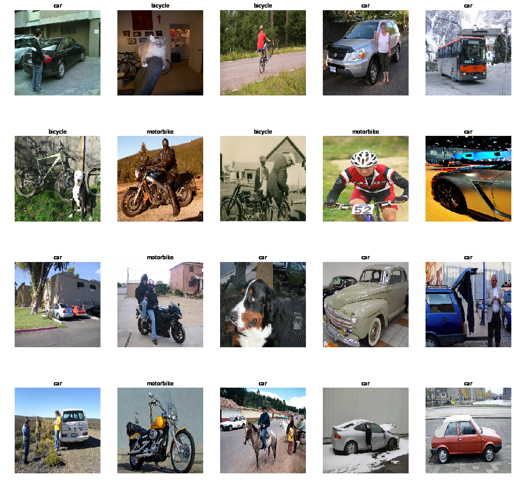
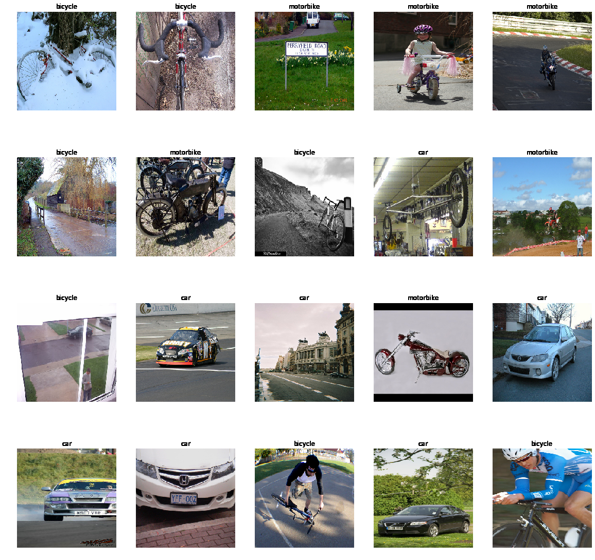

# Vehicle-Classification

Experimental learning project practicing building convolutional neural networks to classify cars, bicycles, motorbikes.
The model uses the VGG-16 architecture as the base model that was pretrained on imagenet. Learning transfered from the early layers and only trained the last 4 layers as well as 3 fully connected layers added on the top of the base model.
The model hit 99.1 % training accuracy and 88.54 % validation accuracy after 42 epochs.

### Dataset

Currently, the dataset has a total of 967 images divided between 3 classes: bicycles, cars, and motorbikes.
It was split to: 80% training set and 20% validation set.

The dataset can be found [here](https://www.kaggle.com/c/image-classification2/data) and it has been downloaded using Kaggle API. 


### Dependencies

[Tensorflow 2.0](https://www.tensorflow.org/install/pip)

[NumPy](https://docs.scipy.org/doc/numpy-1.10.1/user/install.html)

[Matplotlib](https://matplotlib.org/users/installing.html)


### Installing Dependencies

```
pip install -r requirements.txt
```

### Training

```
python train.py
```

### Testing

```
python test.py
```

### Results

#### Loss


#### Accuracy


#### Samples






